## Introduction
This post is about building hiveware for beekeeping. It is historical, as due to time constraints I am not keeping bees at present. 
<!--truncate-->
## Use wood
This is because of a number of overlapping concerns. 
I was using all wood components in my hives, no plastic. 

* In the long term I am interested in doing my beekeeping to the Demeter organic standard. 
* I like working with wood. 
* Having burnt hives, wood is less polluting and intrusive than burning plastic. Hives are required to burnt, by law, in New Zealand, if AFB is discovered.

As part of that process I had to reacquaint myself with the sizes of the various components that make up a hive. I found that there was not much information available online for standard New Zealand langstroth hives and that a previous source at the Wellington Bee Club website is no longer available online. 

For this reason I decided to document the sizes and the process I took and put it online.
## Tools and process
It is important to realise at the outset that making your own hardware from scratch is quite labour-intensive and can't really be justified in terms of an acceptable hourly rate for actually just doing your day job as against the money saved by making your own hiveware. 

That said it does provide the opportunity to reuse and recycle materials in a sustainable manner. I found that the work is quite satisfying. 

A number of tools are required to do the work:-

* Rulers
* Setsquare
* Vise or clamps
* A table saw
* A handsaw
* A sharp chisel

The table saw is perhaps the most important. There is quite a lot of ripping and cross cutting to size of timber in the process. 

This also means that a location for your saw where neighbours are not going to be sensitive to noise is important. If you don't have these things then I suggest that you buy pre cut components.  
## Pre cut
Here are sources for standard NZ langstroth hive components. 

[Alliance](http://beeswax.co.nz/alliance-beekeepers-woodware/)

[Tunicliffes](http://www.tunnicliffes.co.nz/bee-woodware-.html)

If you do decide to go ahead and make your own the next step is knowing what you are going to make. Here is the rough drawing I used. This was derived from the measurements given in Practical Beekeeping in New Zealand. 

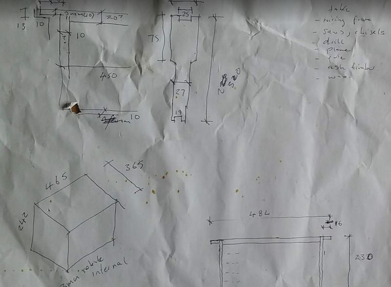

## Frame and box geometry
I made amendments to the frame geometry to make the most efficient use of the timber I had on hand. This was American Ash timber slats which were recycled from rejected components of a tram building project that I am involved with. Very sadly, Ash is available because of [Emerald Ash Borer](https://www.woodworkingnetwork.com/wood-blogs/industrial-woodworker/production-industry-guest-blogs/As-Chestnut-Goes-Ash-Follows-a-Hundred-Years-Later-227585851.html).

Arguably, it is the outside dimensions of the frames that count and if you use thicker sections than would be provided by commercial hiveware suppliers it is unlikely to make any difference to the bees, as long as a 6-8mm beespace is maintained. 

Here are some drawings with dimensions. 
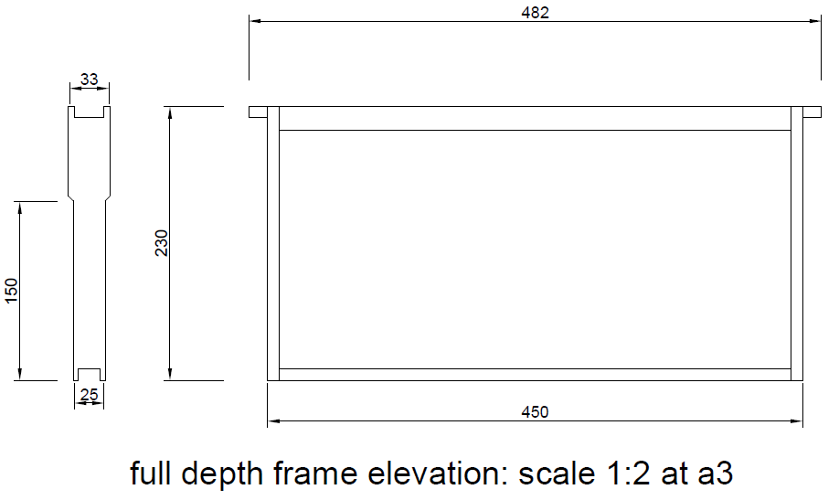

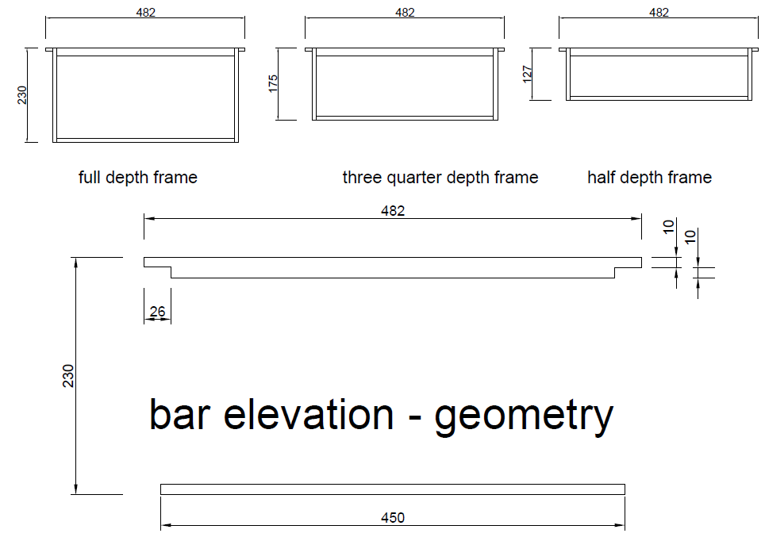

## Tables of standard dimensions

Hive box plan dimensions | Dimension in mm
-----------------|---------------------------------
Timber thickness | 20 (optional, the internal dimension is the important one)
Outer dimensions | 505 x 405 (make larger if thicker timber is used)
Inner dimensions | 465 x 365

Hive box depths | Dimension in mm
-----------------|---------------------------------
Full depth | 240 
Three-quarter depth| 185 
Half depth | 133 

Frame holder (long side of box)| Dimension in mm
-----------------|---------------------------------
Rebate depth | 13
ledge | 10

Frame geometry | box | box| box 
-----------------|---------------|---|----
Item | full depth | three quarter depth | half depth
Top bar | mm | mm | mm 
length | 482 | 482 | 482 
width| 25| 25| 25 
thickness| 16 | 16 | 16 
lug depth | mm | mm | mm 
(at point of contact) | 10 | 10 | 10 
Bottom bar | mm | mm | mm 
length | 450 | 450 | 450 |
width (with rebate in bar, can leave out rebate, if so make thinner) | 25 | 25 | 25 |
thickness | 10 | 10 | 10 |
End bar | mm | mm | mm 
length | 230 | 175 | 123 |
width | 33 | 33 | 33 |
thickness (mine are 20mm) | 10 | 10 | 10 |

## Making 
I made use of simplified geometry for the top and bottom bars. I ripped them to profile and then used a hand saw to cut them to length and check out the ends of the top bars. This can also be done on a table saw and the use of an [dado](https://en.wikipedia.org/wiki/Dado_set) set of blades will make it even more efficient. 

The end bars have more complex geometry. In my case I decided to leave them at the 20 mm thickness of the ash slats. 

The same kind of thinking applies to sizing your boxes, except for boxes it is the internal dimension that matters not the external. You can use larger sections of timber and just make the boxes bigger externally, as long as internal size and ledge geometry remains correct.

Here are a sequence of images, giving some hints as to process, working back from the finished item.
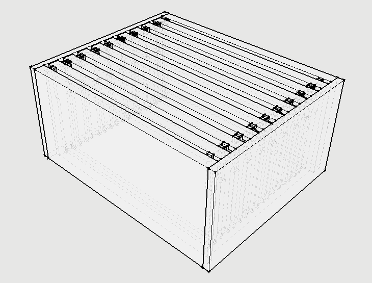

Assembled box and frames.

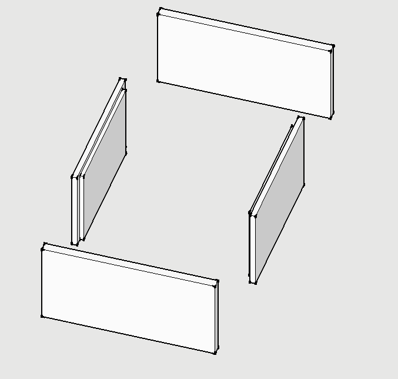

Box, rebate short end for ledge and rebated corner.

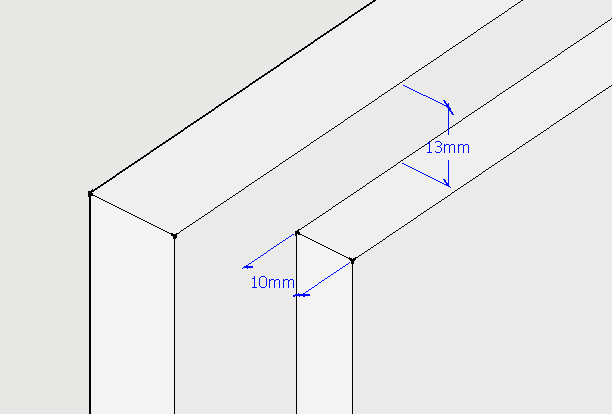

Box, ledge geometry.

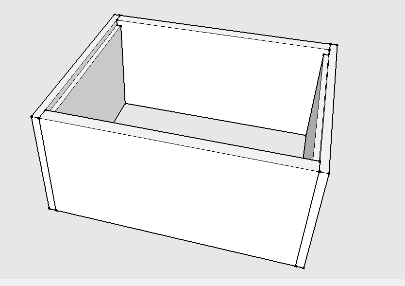

Assembled box.

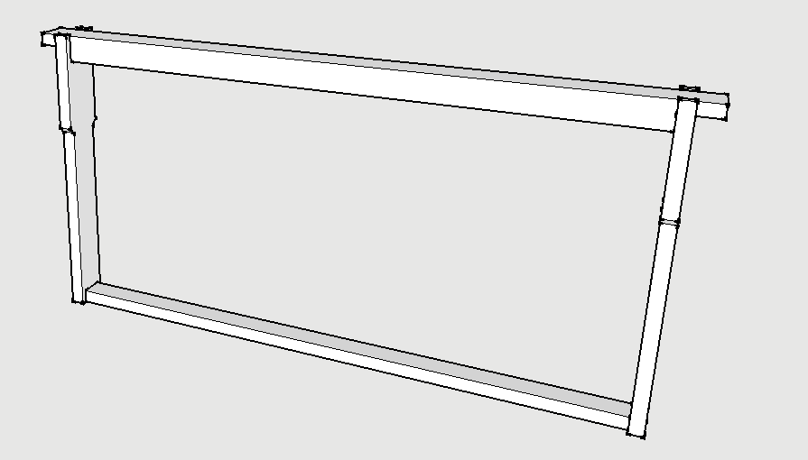
Assembled frame.
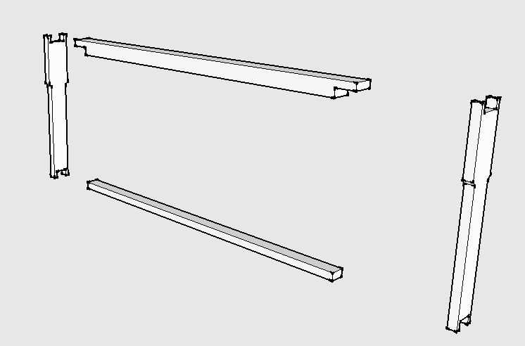

Exploded view of frame.

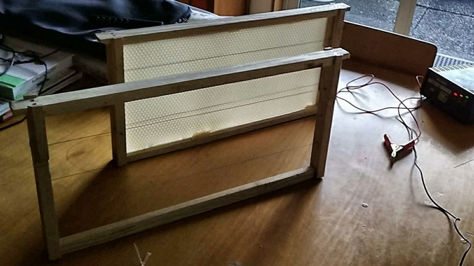

A finished frame.

Frame before hot wire applied to wax. I didn't cut grooves into the top and bottom bar, but used off cut wax to hold in place. A groove is better. Also I used three wire runs here, four is better.

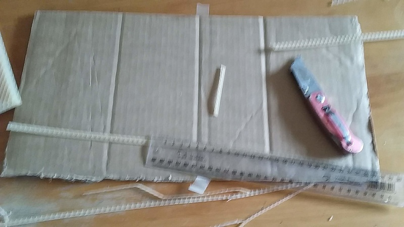

Wax sheets need to be trimmed if the bar geometries are varied as I have done.

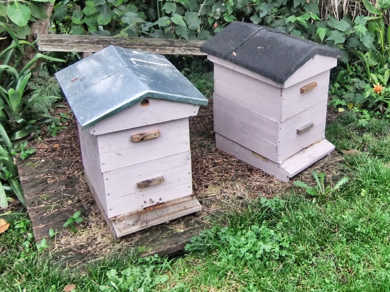

Here are the hives that were burned, made from recycled pallet timber. I used epoxy glue to join timbers to get correct box depths. Ex 250x50 timber is expensive to buy.