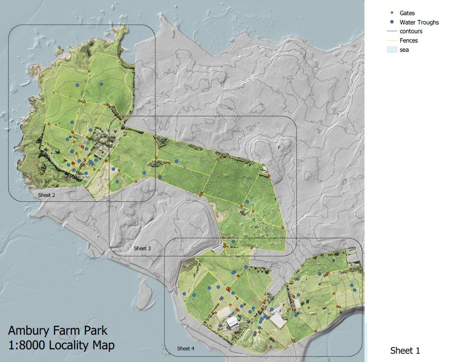
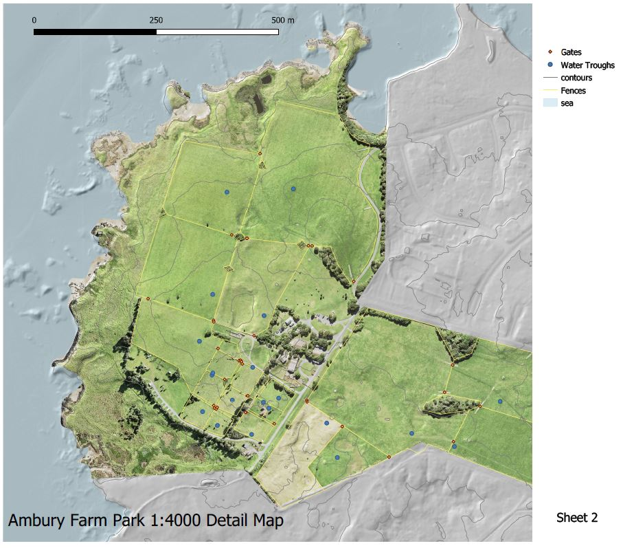

This is an investigation of mapping processes and links to my father's work as a geographer. This came out of a need to map a 100 acre bush block in the Waitakere ranges, west of Auckland.  I then moved to a flatter more farm like site, where easy public access is available. I made both a 3d map, useful for presentation purposes, and available as a downloadable model, and more traditional 2d maps, spatially linked to data and useful for ongoing management.
<!--truncate-->

<iframe class="resp-iframe" src="https://kelpstrewn.com/3dhop/ambury.html" scrolling="no"></iframe>

3d model Ambury Farm Park, allows measurements and section cutting.

## Results ##

Here are some examples of output.

<iframe width="640" height="480" src="https://sketchfab.com/models/14569331d33841738761c0b3a05d282a/embed" frameborder="0" allow="autoplay; fullscreen; vr" mozallowfullscreen="true" webkitallowfullscreen="true"></iframe>

Sketchfab presentation model 100 acre bush block.

<iframe width="640" height="480" src="https://sketchfab.com/models/554925f67fcf40fe985d8eca47d311b7/embed" frameborder="0" allow="autoplay; fullscreen; vr" mozallowfullscreen="true" webkitallowfullscreen="true"></iframe>

*Sketchfab presentation model Ambury Farm.

*More traditional 2d map image, whole site

*2d map image, detail. 

The maps are available as high resolution pdfs, able to be measured and with gps coordinates, with acrobat reader dc.

* [Locality](pdf/ambury_locality.pdf)
* [Detail Area 1](pdf/ambury_sheet2.pdf)
* [Detail Area 2](pdf/ambury_sheet3.pdf)
* [Detail Area 3](pdf/ambury_sheet4.pdf)

## How to ##

The attached [pdf](pdf/mapping_methods.pdf) gives the method.  

 

