This one is aboy a shared family interest in racing sailboats. TWC crewed for Peter Smith on Moana. 
<!--truncate-->
Richmond winter series non spinnaker. 
## The Boat ##
There were two mrx class boats in the race

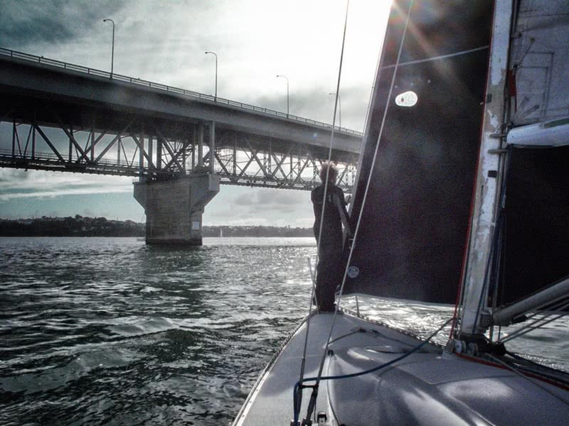

 Relaxed looking crews! The weather forecast had been under constant revision the last few days. Four days previous it was fresh, 20 knots plus. The front seems to have gone through early. Actuality is soft conditions, 3 to 10 knots from the Northwest ,warm and pleasant. 
 On our boat the pre race talk was on lightness. Skipper and owner Colin mentioned ocean racing practice, one cassette tape and one paper back book on each round the world leg for each crew. We are not yet that extreme but do take all sails that will not be used off the boat. The Mrx is already minimal inside, a stripped out race version of the farr 1020.  

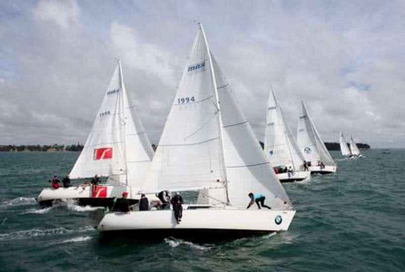

    Photo of start BMW cup a few years ago. Club marine is fourth boat down the line. 

## The Start ##
The start sequence is one of the rituals of boat racing. A few more years ago I went to speedway several times with my teenage son and his friends. This shares a flag sequence and countdown type start. In this series our division starts first, which is nice because we get to lead the fleet down the harbour, until the bigger,faster boats with spinnakers catch us. 

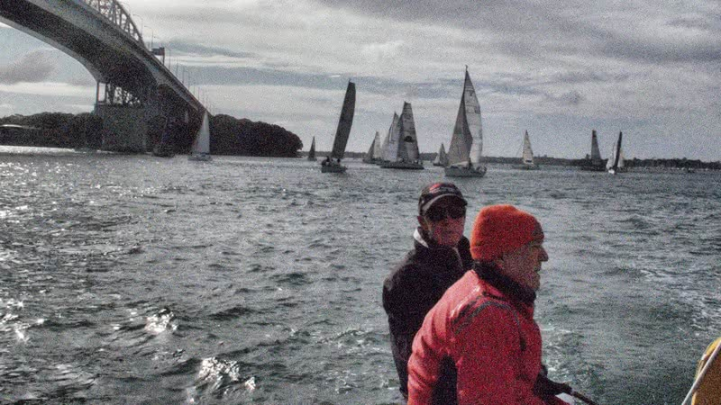

That day tidal flows was an issue. There was a spring high tide a couple of hours before our start, 3.5M variation high to low, which leads to rapid water movement as the harbour empties out. 
## The course. ##

 

For our start because the tidal flow and wind are in the same direction, toward the start line, it is very easy to be over the line, and a boat that is too close will be short of options. We hung to the left of the pin pre start, and went for the pin on starboard tack. We had about two boat lengths of room when the hooter sounded, with good speed on. This put us at the front, just, once things had settled a couple of minutes after the start. Down the harbour there were streaks of pressure, and being in the middle in the area of maximum tidal flow was important. We poled our genoa very shortly after the start and gybed by Torpedo Bay. 

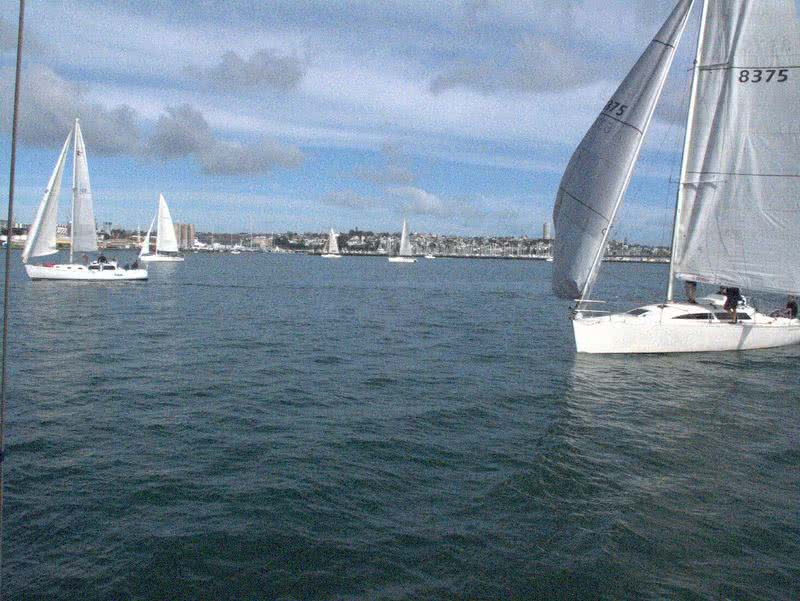
We lead! .... for a while. 

## Down wind to flax point ##
Once set up there was little for the crew to do, except to enjoy the scenery and look for extra pressure. We had five of us on the boat, four from <a href="http://www.sailptchev.org.nz/" target="_blank">Point Chev Sailing Club</a>, which is dinghies rather than keelers. 

We were looking for hints re wind speed; are boats elsewhere going faster and more powered up , and is there change to texture on the surface of the sea? Less glass more ruffle means more wind. A day like this is interesting, if one brings the right frame of mind. Big tide, varying wind strengths and directions make this an intellectual challenge rather than a physical one. 

So enough theorising, here you see a group of spinnaker boats and one from our division about to get on our wind. 

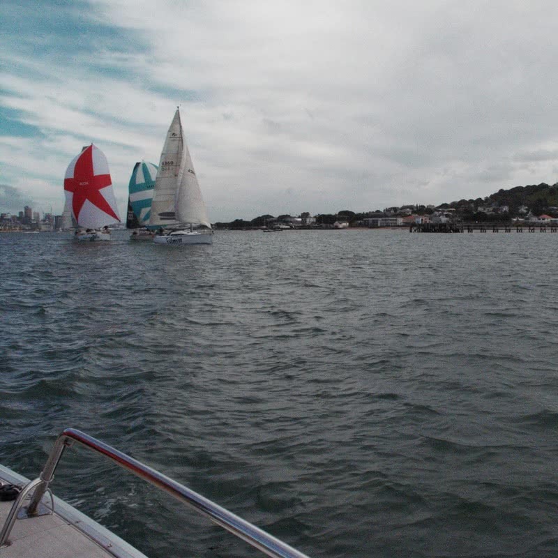 

The position of these boats forced us closer into the lee of North Head than we would have liked. Two boats in our division, Road Runner and Extract Digit, went much wider and came out better. The tide in the channel remained extreme, and we sailed at the mark but were taken well past it by the tide, and so sailed further. 

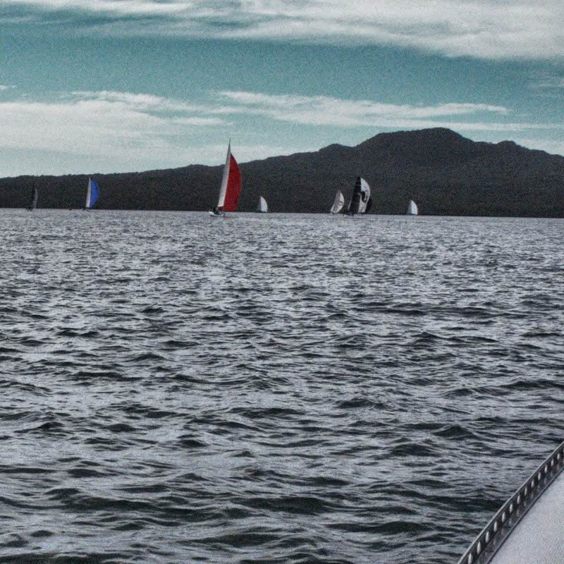 
Flax point is close to Rangitoto

## Flax Point to Orakei ##
The next mark was Orakei, and Colin got this leg right, staying low to get out of the tide early, and then going hard on the wind at the right time to lay. 

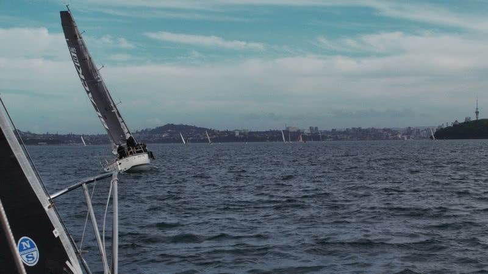 

We rounded with one boat, the digit, in front. Then to resolution bouy, this involved multiple short tacks, as the rest of the race would, to stay out of the tidal flow as much as possible. Again, this was about good helm, Colin picked the shifts better than the digit and we were through them.

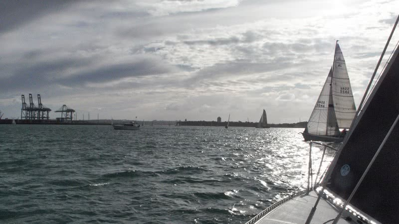 
Tacking duel

## Tidal Gates ##

There have been a series of reclaimations adjacent the wharf area, narrowing the harbour. Today the effect of this was marked, there was a tidal gate beside the wharf, that meant many short tacks and very slow progress to get through. 

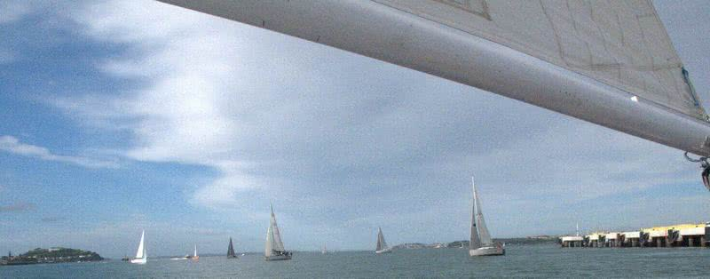 

The fleet compressed, but the reality was that 300 metres up wind could represent 5 or 10 minutes in time because of the gate. 

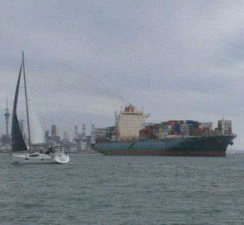  
A ship appeared, luckily before we got to the container wharves.

At this point our nearest competition decided to head to the other side of the harbour to try their luck. We decided not to cover, the judgement being that getting over would be too long in the area of maximum flow, and that there would not be significantly more wind over there. So now, just head for the finish as quickly as possible, and hope we had it right. 

## Infrastructure ##

The series of photos is of wharf infrastructure. The port is the main determinant of the historical geography of Auckland. Also it looks good in the low winter light.

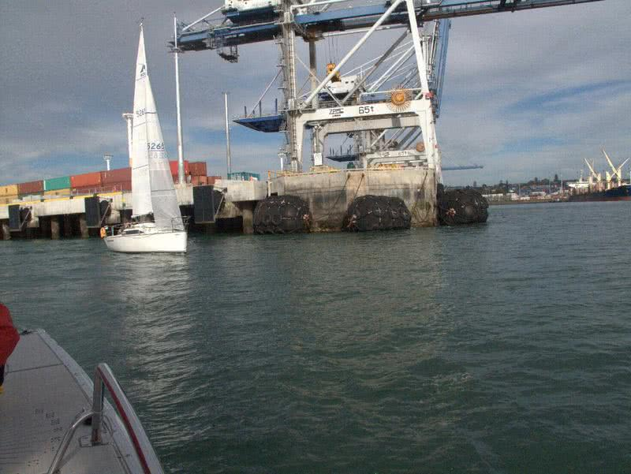 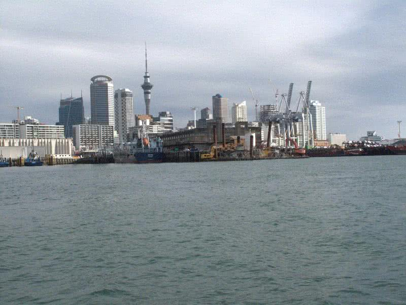 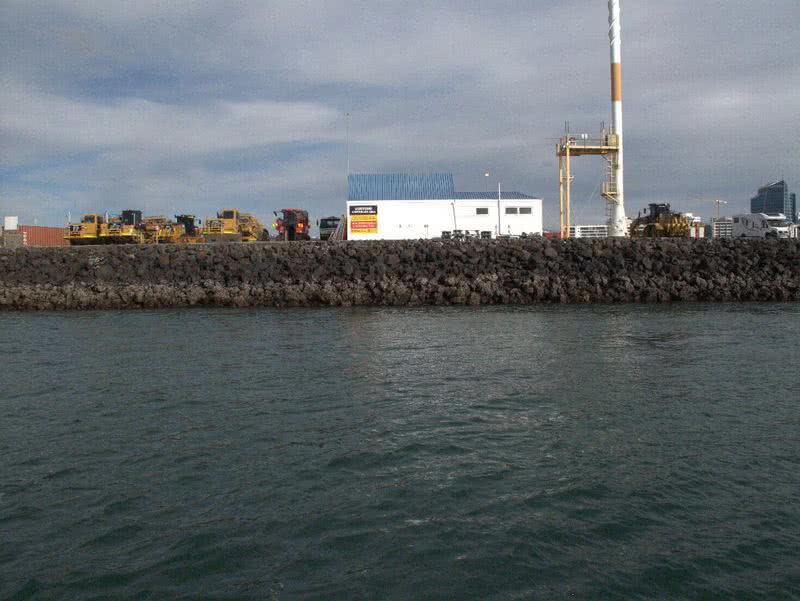 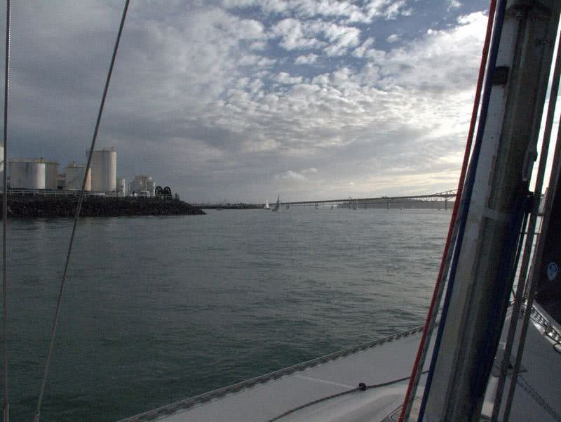

Heading for Westhaven the main challenge was to avoid damaging tacking duels with boats in other divisions. Here is a mini transat, racing in another division.

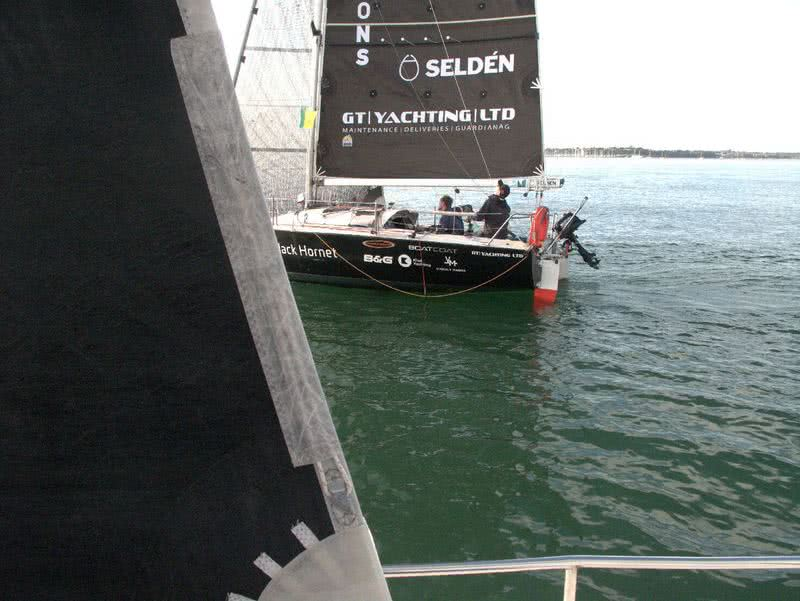
## The end ##
Approaching the finish, the race had been on for more than 3 hours. How have we come out against the boats that crossed the harbour? Ok, as it turned out.