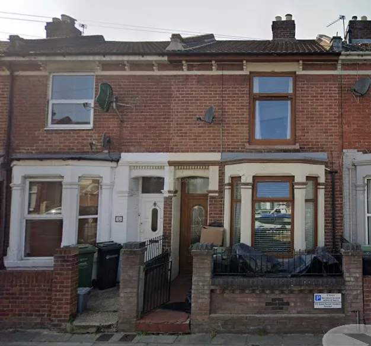
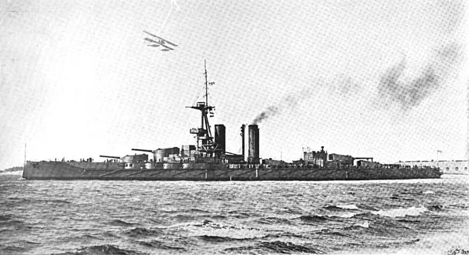
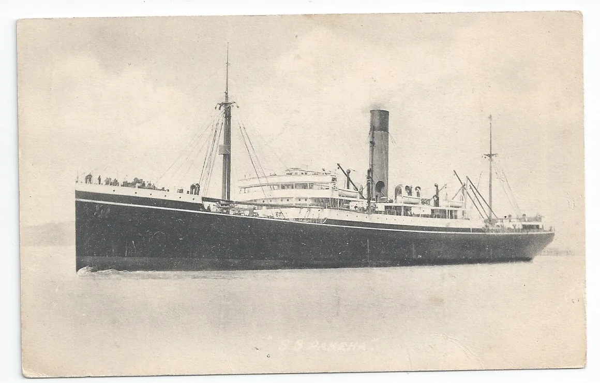

My father's mother was Marion Elsie Vant. She was born in 1897 at Portsea Island. Her parents were John and Elizabeth Vant. The information below is partly taken from research by others using [one name](https://vant.one-name.net/getperson.php?personID=I1684&tree=VK3) archival searches. It is in accordance with what I knew of my grandmother. I knew my grandmother as a child, and had the opportunity to carry that relationship forward in my teenage years and early twenties, but didn't. Now, in later life I regret this. My grandmother was a fine courageous women. 

It is in accordance with what I knew of my grandmother. I knew my grandmother as a child, and had the opportunity to carry that relationship forward in my teenage years and early twenties, but didn't. Now, in later life I regret this. My grandmother was a fine courageous women. 

In 1901 Marion Vant was living with her parents and five siblings at 13 Cardiff Road, Portsmouth.  My father visited Portsmouth after he retired, and went to this street. As the picture shows this is a tiny house for a large family. 

*13 Cardiff Rd, from google maps*

In 1904 John Vant died. The family lived in difficult circumstances after this, and the older siblings had to seek work as soon as they were able. I remember my grandmother telling me that a family member worked in naval architecture, and other family members emigrated to Canada, where they had military careers. 

*HMS Iron Duke. Battleship building prior to the First World War was an immense and complex program of public works. This ship was built in the Portsmouth Dockyards and was commissioned in 1914 as fleet flagship. When the British Empire was at its height of power, covering a quarter of Earth's total land area and 458 million people at the turn of the 20th century, Portsmouth was considered "the world's greatest naval port". In 1900, Portsmouth Dockyard employed 8,000 people – a figure which increased to 23,000 during the First World War.*

My grandmother was close to her sisters, and I recall her getting letters from them fifty years after she left England. She never had the opportunity to return to England and her memories of England were influenced by her early life experience, living close to the heart of the imperial project.

My grandmother was a nurse towards the end of the [First World War](../03-Military/First World War.md).  In January 1922 she was a passenger on the SS Pakeha to Wellington, New Zealand. She sailed 3rd Class. Before she emigrated, she was working as a nurse at the Long Grove Mental Hospital, Epsom, Surrey. 

  
SS Pakeha built 1910 decommissioned 1948

On arrival she worked at the Rotoma Tearooms and Post Office and it is here my grandparents met. They married in 1925. Their son John was born in 1926.
