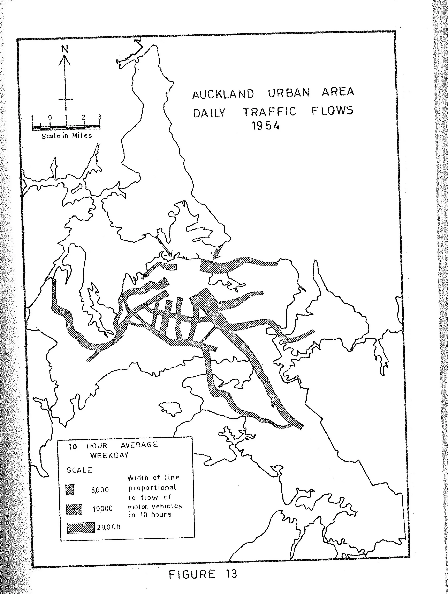

My father Tom attended university when he came back from the rural part of his primary school teaching career. His specialist subject was geography. He was mostly at university part time and  had one or two full time years. He enjoyed his time at university and often told stories of his flat in Devonport. 

I thought that I remembered that when I was about eight or nine that Dad spent a lot of time working on his thesis for his Master's of Geography.  This turned out to be wrong as I have that document and it was  completed in 1963 when I was one.

I have memories of going with him to Teachers College where he worked after leaving Selwyn College. I watched him prepare maps for his geography class. He allowed me to use his mapping pens and stencil. I eventually trained and qualified as an  [architect](https://sccv-2020.ts.r.appspot.com/) and spent most my working life in architecture. 

We are linked by a concern for space. 

*A planning map from my father's masters thesis. These maps were drawn by P.Shaw, who may or may not have been a cousin of my father's.* 

This thesis was entitled "Areal Changes in the Retail function of Auckland" and was about the transition of Auckland from being based around the tramways to a new cityscape that was vehicle orientated and based around suburban strip shopping. This was a key point in the development of Auckland as a city. 

Planning maps were to become very familiar to me. When I took a job working for Auckland City Council as a conservation architect the zoning of the heritage of the city was an important issue. Dad taught geography and my memory is that he taught at Westlake Boys High School and Selwyn College before going on to become a lecturer at Teachers College in Epsom. He eventually rose to be head of the Geography Department. At his best he was a good teacher. I have met some of his ex pupils and they spoke highly of his geography teaching. 

Later in his career, a good friend of mine was taught by him at teacher's college. I think perhaps that he was not as good by then, he may have become a little stale towards the end of his career. I recall that he wrote a textbook together with two or three of his colleagues. It was about the geography of the United States.  He also wrote research papers.