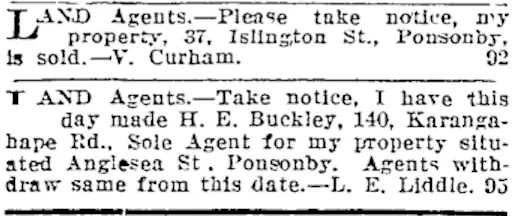
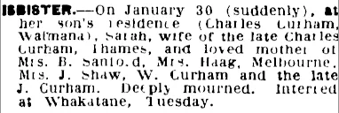
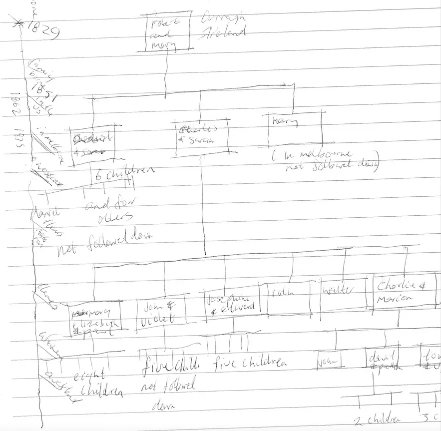

### Grandmother
Sarah Gibbs Oliver was born on July 7 1865, in Bolton St, Newcastle, New South Wales. Sarah Gibbs Oliver married Charles Curham in 1883, at age 31 in Woodstock, Hokitika where he was a gold miner. They had 6 children. 

### Aunts
Margaret Elizabeth Curham was born in 1884. She married Paul Sanford in 1906. Paul was the son of Alfred Sanford, founder of Sanford Ltd, now New Zealand's largest fishing company. There were eight children.

Josephine Curham was born in 1890. Josephine had five children between 1910 and 1922. There is mystery about the father, but her first child had the surname Shaw, and she married Edward Shaw in in 1934. Josephine was Dorothy's mother. 

Marion Ruth Curham was born in 1892 and died in 1911.

### Uncles
John Curham was born in 1888. He was a fireman and then a bus driver. He had five children and was married to Violet Fisher who lived in Islington St Ponsonby in 1919. There are coincidental family connections in the notice below

[Walter Curham](../03-Military/First%20World%20War.md) was born in 1894.  He did not marry. [Robert Charles Curham](04-Father.md) was born in 1897.  He was my grandfather.

Sarah's  husband Charles passed away unexpectedly in 1906, at age 53 in Thames. 

Sarah Gibbs Curham married again, to John Isbister in 1909. A child was born to the couple in 1909, John Spence Isbister. John had a daughter Joyce, my father's cousin, who we visited when I was a child. Joyce was glamorous and her partner had a restaurant and drove a Daimler, which impressed us greatly.

This death notice from 1938 is informative. Mrs Haag remains a mystery. My father was six at the time, but did not mention memories of his grandmother to me in later life. 

A rough sort of tree follows.

