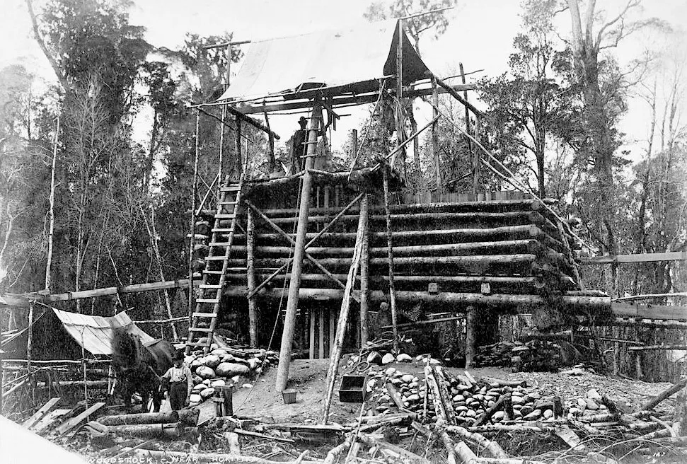
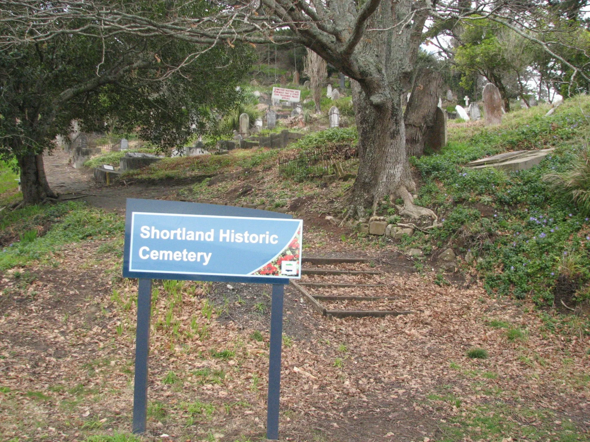
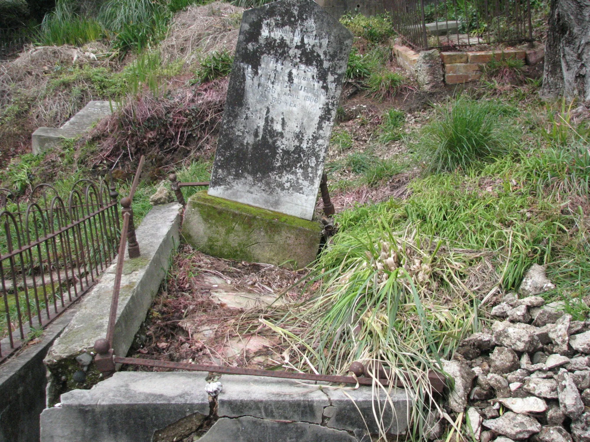

My great grandfather, Charles Robert Curham was born in 1851, in Kildare. His parents were Robert Curham and Mary Anne Curham nee Darker. There were two siblings,  Robert Samuel Curham and Margaret Elizabeth Curham. Margaret was married in Melbourne in 1865 to James Michael Kilfedder. It seems that there is truth in what my father told me, that the family left Ireland due to impoverishment in the countryside, with family members going first to the United States, on to  Victoria, and then to the west coast of New Zealand, in search of gold. 

*Mining at Woodstock in 1870*

In Ireland people with the Curham surname worked in the textile industry, some as tailors. Robert, brother of Charles, completed an apprenticeship as a draper, before the family left. There is evidence in the record that the Curhams were Catholic in Ireland. Family weddings were held in Catholic churches.

Charles married Sarah Gibbs Curham (born Oliver) in 1883, at age 31 in Woodstock, Hokitika where he was a gold miner. They had 6 children.

His older brother Robert fought in the American Civil War and was at sea in sail for 10-15 years after that. He came ashore in Melbourne where his sister lived and worked at the gas works. He married in Melbourne. Robert then moved to Hokitika where he established and managed a gas works. 

Charles was eventually employed by his brother at the works. The two brothers moved north with their families. Robert to Whanganui, and Charles to Masterton.

Charles appears in The Cyclopedia of New Zealand, Wellington Provincial District in 1897.

*The Masterton Municipal Gasworks are situated in Bannister Street, occupying a fine section of two acres of land. The buildings, which are substantially built in brick, include a retort house, in which there are ten gas retorts, a purifying house containing four purifiers, a metre house, where up to 6000 feet per hour is registered, and a workshop and a governor house, which has eight inch connections. There are two gasometers, having respective capacities for 24,000 and 20,000 feet of gas. Twenty-six street lamps in the main thoroughfares of the borough are lighted by contract in addition to the town clock at Mr. Dougall's and the Church Street fire brigade station. The works are under the care of Mr. Charles Curham as manager.*

The brothers moved again in the new century. Robert went south with his family to Port Chalmers. Charles moved north to Thames where he worked at the [gasworks](../02-Infrastructure/Gas works.md) but not as manager. Charles passed away unexpectedly in 1906, at age 53 in Thames. He is buried in the 
Shortland Cemetary.

[Charles Curham - Historical records and family trees - MyHeritage](https://www.myheritage.com/names/charles_curham)
