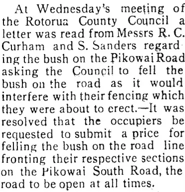
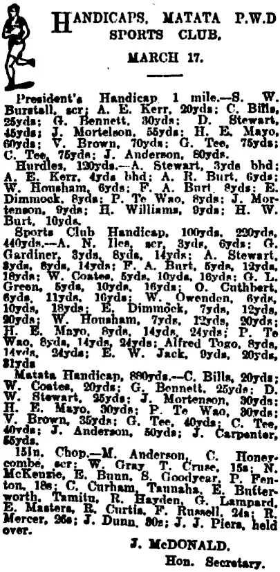
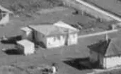

My grandfather, Tom's father was Robert Charles Curham. He was the youngest son of six, three boys and three girls. They lived in Thames. Robert was named after his father and uncle. His father Charles Curham died at 53 in 1906. Robert Charles was known as Charlie. He worked as a bushman clearing the Kaihikatea forests of the Hauraki Plains. He joined the [ army](../03-Military/First World War.md) in 1915 and was a mounted rifle in Egypt, Palestine and Syria. 

Returning to Aotearoa he obtained a bush block on the Pikowai Rd in the Matatā district, between the sea and Lake Rotoma, likely through the Discharged Soldiers Settlement Act. This he cleared for dairy farming. My grandparents met and married in 1925. There were three children, David, John and Thomas, my father. 

*The farm location 1921*

*Woodchopping in 1923*

The family quit the farm due to debt and the depression in 1931, walking off as it was not saleable. Tom's view was that they could have hung on by just not paying the mortgage. Mortgagee sales were not really an option for the banks due to the depression. However, Tom felt that his parents chose not to do this as they were uncomfortable with not meeting the obligations they had.

The family then moved to the top of the Waimana Valley, where the road turned into a track to Maungapohatu. My grandfather farmed sheep here for an absentee owner, and the family lived a subsistence lifestyle during the depression. 

My father and grandmother both had fond memories of this period. Most of the neighbours were Māori and my grandfather supported free access over the absentee landowner's land that he farmed. Family stories included pig hunting, soap making, and the daily horse ride to the local primary, a distance of eight miles, with my father and uncle sharing a horse.
This is despite the family tragedy that occurred in 1929 when John Curham drowned at Rotoma. The family left Waimana in 1946, and were well liked in the district. I think that they left to find better opportunities for David and Thomas, as the valley was isolated.

The article gives some sense of the life they lived. Moving to Tauranga Thomas attended the high school, and the family lived at the Mount, where my grandfather worked for a seed merchant. The stay here was short-lived, and a peripatetic period followed. Dairy farms of poor quality, near Huntly, and near Waitakere village were brought and sold. By 1950 my grandfather was working as a watchman at Whenuapai, staying at the barracks for part of each week. The family built a two bedroom house in Swanson, that had a large laundry and sleep-out in a fibro clad outbuilding. 

I visited there often as a child. My grandfather died in 1964 when I was a small child, and I do not have clear memories of him. My grandmother lived until 1985.

My father remembered that Robert Charles Curham valued his job at the airbase. His status as a First World War veteran was a factor, and he enjoyed working there. The new house and settled employment were positive aspects of this 1950's decade.

My uncle David trained as a carpenter and played senior rugby for the Waitemata club. He was personable and active socially. He contracted polio in one of the 1950's epidemics, likely the second epidemic. This was life changing, as David suffered through a long period in an iron lung and emerged having lost the use of his arms. He married Pauline and I went on day trips with them and my grandmother as a child, in David's Hillman Hunter car which he drove and steered with his feet.

