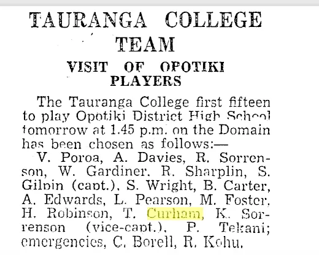

As a child, visiting my grandmother we sat in her small lounge , a formal room, not for everyday use. The room was dark and had lace curtains that were always drawn, as glare caused my grandmother discomfit. We played parlour games and cards in an atmosphere of formality. My grandmother had very old empire annual type books which we were allowed to read while the adults talked and took tea. All this was unusual in 1960's and 70's New Zealand, and in stark contrast to our visits to my maternal grandparents. 

It is indicative of the way my father lived as a child when indoors , a culture established by my grandmother's formative years in Portsmouth. 

Paradoxically, my maternal grandparents, who were both from suburban Mount Eden families enjoyed the wild spaces of west coast Auckland. There, in their leisure they did early settler type activities, living under canvas, building a bach in a bush clearing, fishing, bush walking. 

My paternal grandmother (and father) had actually lived this life, in Rotoma and the Waimana, and did not seek to re-enact it in her old age.

Prior to the early 1970's and the coming of Japanese pair trawling we fished off the rocks with rangoon cane rods, surfcasting at Karekare beach, where the bach was. Fish were large and plentiful. 

TWC played rugby as a young man. He was a lock like me. He was a better player than I was, making the First 15, and in the fifth form.

Dad maintained friendships with David Napier (an army friendship) and Ken Prebble (a teacher who was at university with him). David introduced him to trout fishing, which he loved. He fished the Tongariro river, and was for many years a member of Taltac. Like me, he was a keen participant in sports but was not an excellent competitor. The scene at Taltac was highly competitive around who  had the most and biggest fish on any given day. 

In midlife Dad took up jogging for fitness, and I remember in the early 70's both him and I running around Lake Pupuke in very unsuitable canvas shoes. Dad went on to complete a number of marathons, but I always hated running. Dad was notorious for his unusual running style.

He crewed for a few years on an old A class Logan designed yacht, Moana. This was owned by Peter Smith who he worked with. We used to go to Devonport and work on the boat during haul outs. 

Dad also enjoyed footling along having many cups of tea and reading the paper, perhaps an echo of his early life with my grandmother.