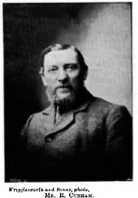
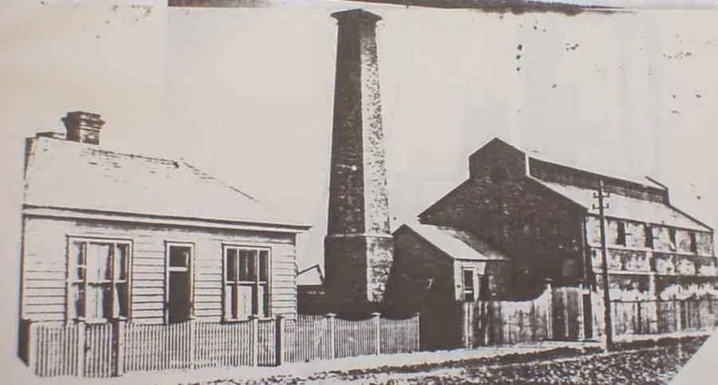

A notable Curham, Robert Samuel, grew up in Curragh, Kildare, was apprenticed as a draper in Dublin, then was an artillery man, and then at sea in sail. Coming ashore, he married in Melbourne and was employed at the gas works. The use of coal gas for domestic lighting, cooking and heating was an emerging technology in the second half of the 19th Century, and was in competition with electricity into the 20th. R.S. Curham went on to run the works in Whanganui and in Port Chalmers. 

Despite not having a technical education, he seems to have been confidant on gas related matters. Robert Samuel was the older brother of my great grandfather, Charles. Charles managed a gas works in Masterton.  In Thames he worked in the gasworks, shown below.

