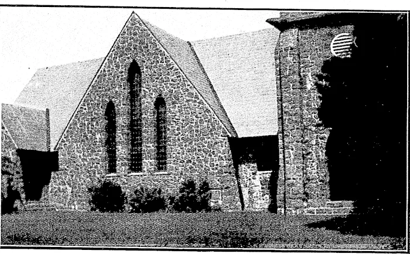
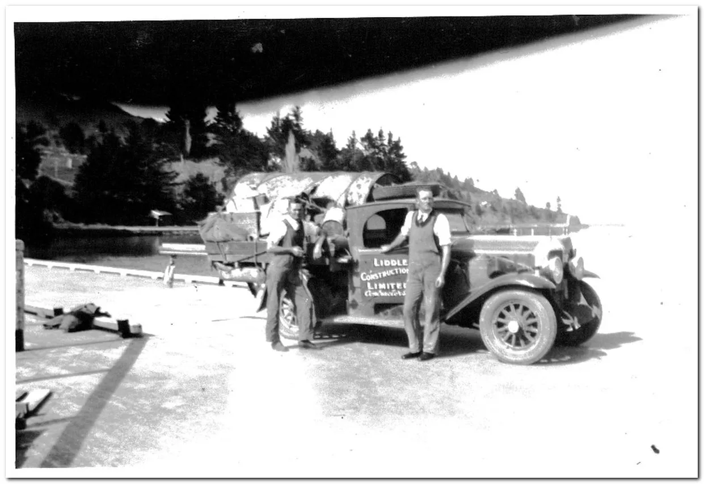
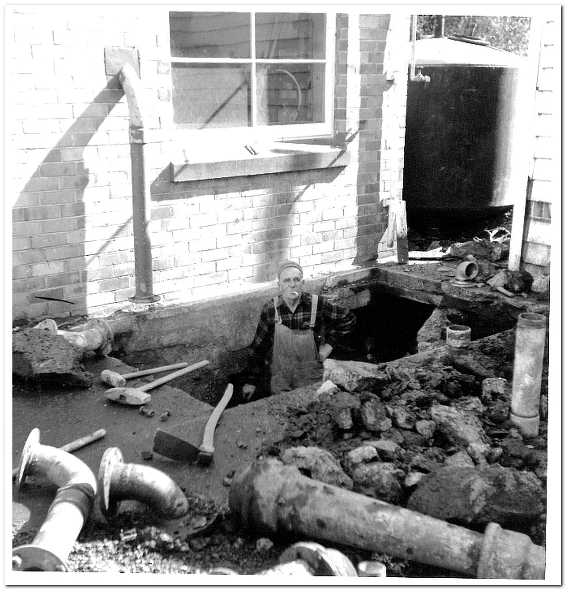

My mother's family also did infrastructure. My maternal great grandfather and his brothers built villa houses close to Eden Park, and the stone church at Paihia. My grandfather told stories of this project, he was a child at the time, and the extended family relocated to Paihia during construction.

Here are my maternal grandfather's brothers, on top of one of the new water supply dams in the Waitakeres, in the 1920's.

Here is my maternal grandfather in a hole at a petrol station, installing a petrol tank. Harry Liddle Ltd specialised in this work.

