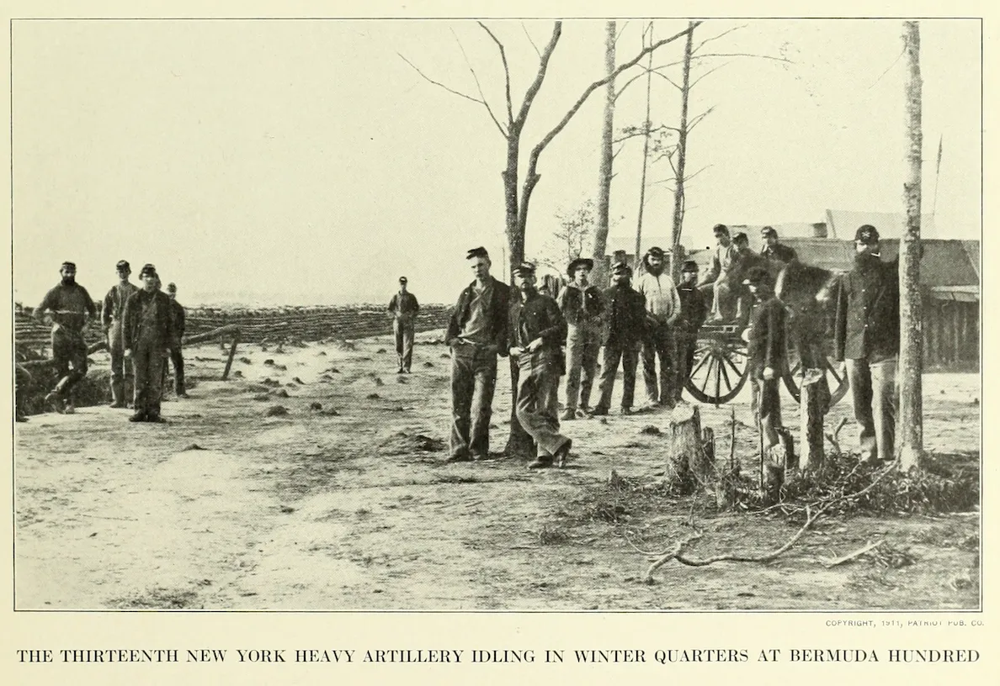
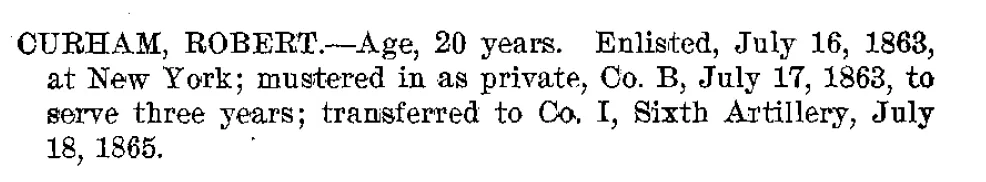

[Robert Samuel Curham ](../02-Infrastructure/Gas works.md) enlisted into the 13th New York Heavy Artillery Regiment, Company “B” on August 29, 1863 fighting under under General Ulysses S. Grant until hostilities ceased in 1865.

*Taken from Photographic History of the Civil War Volume III The Decisive Battles, Francis Trevelyan Miller, editor-in-chief. New York: the Trow Press, 1911, page 95*

*Register of the 13th and 14th artillery in the war of rebellion. 1897*

