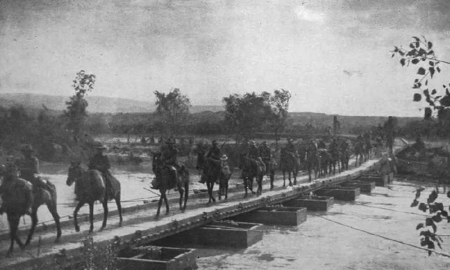
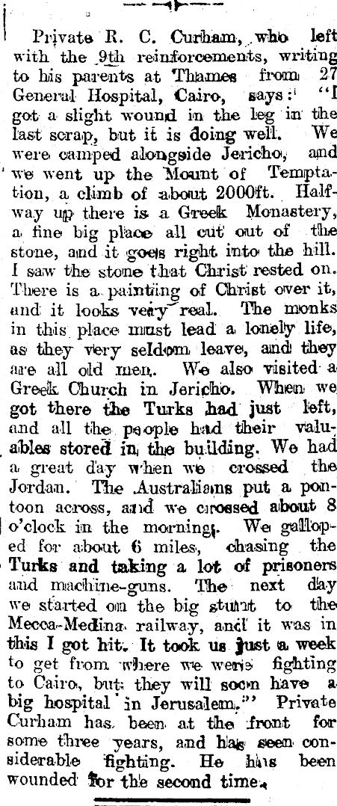
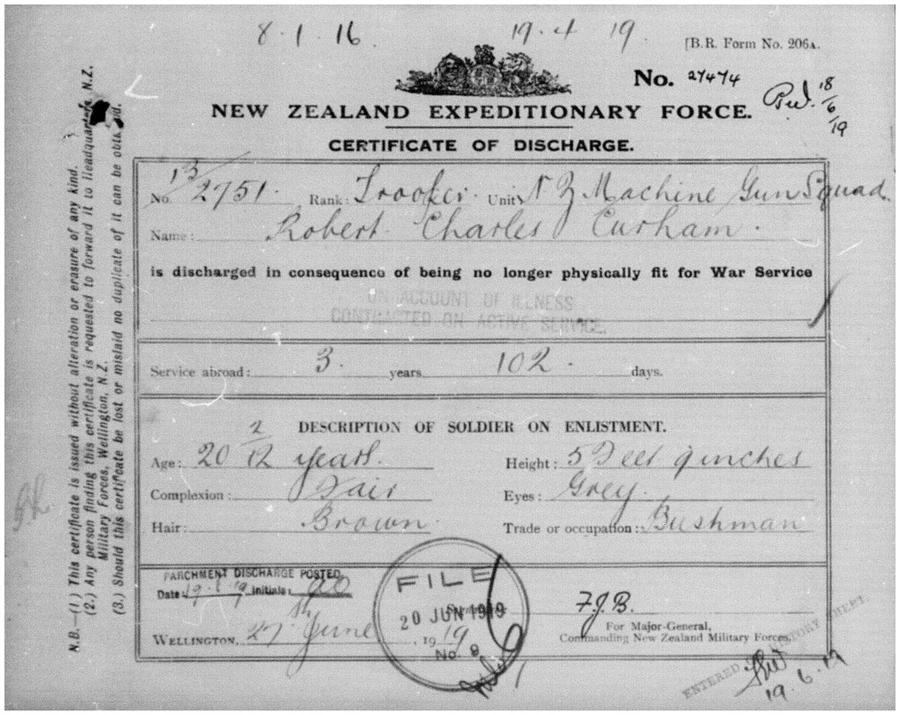
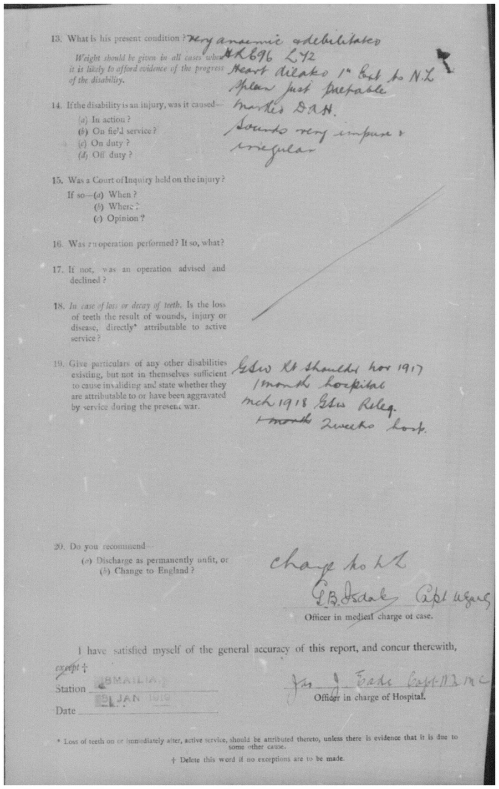
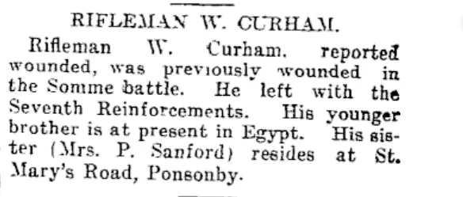
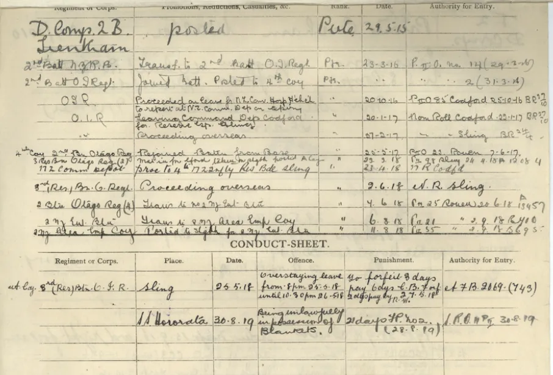
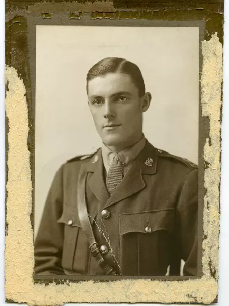
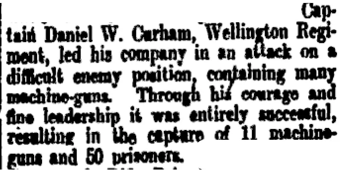

### Marion Elsie Curham
[Marion Elsie Curham ](../01-Thomas William Curham/03-Mother.md) (nee Vant), served as a nurse close to the Western Front. I was unable to find records of this in the British Military Nursing Archives, and these organisations generally had an entry age of 23 for overseas sπervice. It is likely that she was in France in the last years of the war. She had photographs from France that she showed me, but these have been lost in the process of my father's second marriage. This history, together with my grandfather's time in the Middle East was very present in my father's early life.  I recall little details, like my grandmother getting a delivery of coal every winter from the Swanson RSA, into the 1980's. She transported soldiers by ambulance as they were moved back from the front after being wounded. I recall that she said that she learnt to drive as part of this.

### Robert Charles Curham
[Robert Charles Curham](../01-Thomas William Curham/04-Father.md)  enlisted into the 9th Reinforcements, Auckland Mounted Rifles, A Squadron, New Zealand Expeditionary Force and left NZ on February 1916 on troopship Maunganui. He fought under under General Allenby until hostilities ceased in 1918.

*Mounted rifles crossing the Jordan.* 

*Here is a letter describing the crossing of the Jordan published in a Thames newspaper in 1918.*

Robert Charles Curham got malaria in the Jordan Valley, and was hospitalised and then shipped back to NZ on the Kaikoura in 1919, and he was periodically bothered by malaria throughout his life. This was on top of two other wounds he was hospitalised for, including a gunshot wound to his shoulder. In 1916 he was a lance corporal, but finished the war as a trooper in the machine gun squad.

*Military records are  now online. This is part of a set of records that runs to 25 pages.*

The campaign stretched over three years and there are a numerous contemporaneous books on the campaign in the internet archive and a recent book, *Devils on Horses: In the Words of the Anzacs in the Middle East 1916-19* by Terry Kinloch. The campaign was difficult and unrelenting, involving many quite small scale engagements and several large battles. 

The New Zealand contingent started as 147 officers and 2,897 other ranks. A total of 17,723 New Zealanders rotated through during the campaign, with sickness and the very harsh conditions of the campaign factors in the high rate of attrition.  New Zealand casualties were 640 killed in action and 1,146 wounded.

### Walter Curham
Walter Curham, my father's uncle, enlisted into the 7th Reinforcements, New Zealand Rifle Brigade, 2nd Battalion, A  Company,  as a rifleman and left NZ on November 1915 on troopship Tahiti bound for France. He was wounded  in 1916, recovered, and was back in battle in May 1917.

### Daniel William Curham  
Daniel William Curham  enlisted into the Main body, Wellington Infantry Battalion, New Zealand Expeditionary Force and left NZ in December 1914 on troopship Arawa or Limerick. 

Daniel William Curham was the son of Robert Samuel and Janet Curham and was my grandfather's cousin. He was born in 1894. Given the repetition of names between the two brother's families and the shared work histories in the gasworks close relations between the families must have existed until the death of Charles Curham in Thames at age 53. 

Daniel William Curham was present throughout the most bitter fighting the NZEF experienced. He was long lived and was interviewed by Maurice Shadbolt in the early 1982. This interview is in the oral history archives and is recorded in Shadbolt's book Voices of Gallipoli.

*In the National War Memorial in Wellington, Elias gave “the oral history reading”—part of an interview in 1982 by Shadbolt of Dan Curham, the only survivor of sixteen companions who had set out together on the Chunuk Bair offensive: 

*By some miracle I was the only one who got anywhere near the summit of Chunuk Bair. I never saw or heard of my companions again. I don’t even know what happened to their bodies. I didn’t weep physically. I was not a weeping chap. I wept in my heart. I have felt their loss very deeply for the rest of my life. Talking about Gallipoli, especially about Chunuk Bair, brings sorrow to my heart, even as I talk to you now.
Lest We Remember/“Lest We Forget”: Gallipoli as Exculpatory Memory 
an article by John Bevan Smith

Daniel William Curham began as a private, became a warrant officer, and was promoted "on the field" to lieutenant. He finished the war as acting captain and received the Military Cross for an action involving the company he commanded late in the war. He was a popular officer. During the Second World War he commanded a home guard unit in Whanganui and reached the rank of Major.

*NZ Herald report on the granting of the Military Cross.

