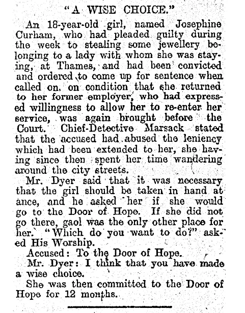
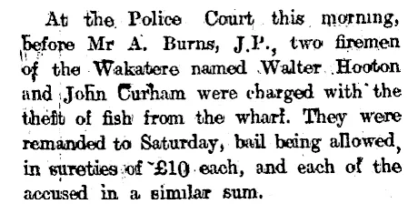
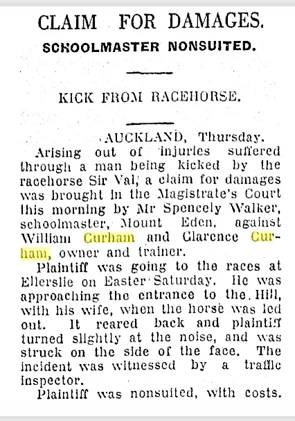
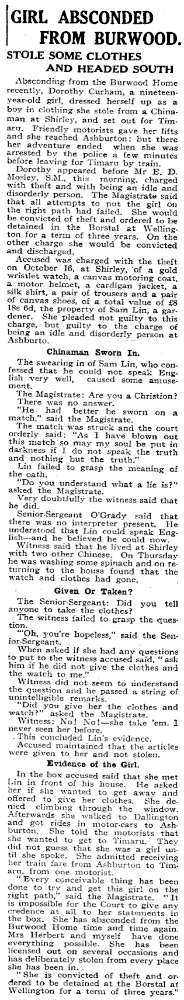

Difficult parts of the family history include troubles with the law experienced by my grandfather's brothers and sisters. This may be a contributing factor to the amnesia regarding the family history which was discussed elsewhere. Papers Past reveals that Josephine Curham appeared before the court  as did  John Curham. Josephine and John appear to have put this behind them. 

*Thames Star 1917*

There is also the interesting case of William and Clarence Curham who appeared before the courts in a civil action involving a horse that kicked a teacher. 

*Waikato Times 1938*

A much more disturbing story is that of Dorothy Curham the daughter of Josephine Curham, born out of wedlock. Dorothy was my father's cousin. She seems to have been lost to the family. The reporting of her case is cruel. She seems to have been a vulnerable person who did not receive in any way the support she needed, either from the state or from her family.

*Christchurch Star 1930*

I too, (Stephen Curham) have appeared before the courts on two occasions when I was young. One of these was at age 19, for stealing a bottle from a bottle shop. The other was at age 21 when I crashed a car into a lamp post next to the Kiwi Bacon Company building in Kingsland, while over the blood alcohol limit. I was fined, but I don't think I made the papers of the day. 

This was a period where I was lost morally and emotionally, and binge drinking. These and other actions brought shame on me, and on my family. I carry the burden of this with me to this day. Because of this experience I have a sense of how these events happen, and empathy for these other Curhams.
