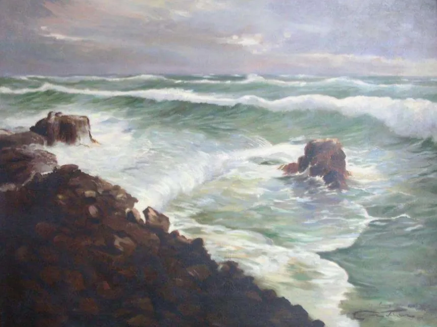

From 2008 to 2020 I worked as conservation architect for the Auckland Council.
I learnt a lot about heritage and its workings in the twelve years I had in this job. 

Heritage is not history, it is about identity and culture. The disciplines of history; archival research, sources and revision are not applied. An uncritical reliance on physical evidence (in Aotearoa, Kauri timber houses, broken plates, old bottles) is often found. 

What I write here is both heritage and history, a hybrid, a mix of archival research and things I was told, that were told to reinforce the identity of the teller. I wish to factual, and will resist the temptation to suppress parts of the historical record that are difficult or painful.

About 10 years ago I looked into the archives doing one name searches into my father's family. The names, Curham and Vant are not common. Much was found in newly online archives and this made this approach viable.  

I found out things that my father had not told me and sat with him and went through it. He was quite disengaged, and noncommittal about what I found. 

For example there were seven uncles and aunts, siblings of his father, that had never been discussed. There was a southern branch of the family, directly related. There was the tragic death of a great Aunt at 19. There was a significant military history beyond that of his father and mother, and almost miraculously, given the conflicts, all who served survived. Several of the uncles and aunts resided in the same town as we did, in Freemans Bay and Ponsonby.

Tom did mention some of the things I found in the archives in the course of our lives together. I was aware that he had visited the Sanford family in Ponsonby as a youth, but was not aware that Mrs B. Sanford was an Aunt. As a young man I too lived in Ponsonby, and frequently passed the Sanford fish yard. I was aware that there was a family connection to Thames as we visited the gold museum there during a trip to Coromandel. I did not know details of the family, and thought that my great grandfather was associated with mining in Thames. I did not know of the family connection to coal gas. I did not know that my great grandmother remarried after she was widowed, and became Mrs Isbister,  even though we were visited a number of times by Joyce Isbister when I was a child.

I am not sure why so much that is here was previously undiscussed / unknown. It may be that Dad was simply forgetful, or that he was living in the 'now', and not thinking about the past. It may be that there was much he never knew, and that the breaks in family continuity (eg the early death of my great grandfather  and remarriage of my great grandmother) caused this loss.

Or it may be that family stories, identity, and heritage are not history. The stories that bolster the chosen identity of the teller are those that are told. In the case of my father his identity was tied up with themes of progression in the social hierarchy through education. This is also true of his second wife, who was present when we discussed some of what is presented here, about 2010. It may be that he chose to downplay his Ponsonby Irish family connections. If so there is some dissonance here, as Tom was a dual passport holder and went to some effort to obtain an Irish passport based on his grandfather's birth in Curragh, Kildare.

My father was a complex personality, we had that in common. Both my father and I were slightly delicate, sensitive and socially awkward children. Our families supported us in their own ways, and encouraged engagement with our peers and the rough and tumble of the schoolyard and sports. We both developed different strategies for dealing with our awkwardness. My father enjoyed being part of hierarchical organisations and found meaning in "fitting in" and engaging with the culture of those organisations, although he was not always completely successful and remained prone to social awkwardness. I was more oppositional and individualistic in approach in a decade (1970's) when these values were to the fore. 
  
Dad frequently read me books for a bed time story, and often these were coming of age stories, such as Kipling's "Captain's Courageous", where a spoilt and entitled boy learns to be part of crew culture. The boy matures, becomes an effective Grand Banks fisherman and heads to university in preparation for taking over the family shipping line. 

I attempted this, leaving home at 16 to be a farm worker, but failed to mature or fit in well in the rural scene. At 20 I came back to Auckland and succeeded in gaining entry into architecture school.

I like to tell an alternative version of these events, less close to the bone. Takapuna Grammar in the 1970's was a benign but slightly chaotic environment under headmaster Jack Kelly. Many of the teachers were eccentric, in retrospect. I had surprised everyone by doing ok in school certificate and was looking likely to succeed in the sixth form. My dutiful parents felt that I should engage with the newly appointed careers guidance councillor, Mrs Geary, to plan ahead. Mrs Geary, in retrospect, must have been appointed because she was particularly eccentric and no longer suitable for classroom duties.  She asked me if I liked to be outside, and then said that farm work would be a good fit for me. I was an unprepossessing youth, and my poor self presentation no doubt contributed to her guidance, which I took without question.

Here, we run into some important issues that those doing history face. Both interpretations of my early decision making have some basis in fact, but which is causal, or perhaps neither are? Having lived these events I would say that I don't know. There is lots of interpretation as I look at archival sources, and seek to combine these with family stories. But the rightness of these interpretations must always be questionable, particularly so for events that occurred 100 years ago.

Being oppositional was a part of personality formation for me. In psycho-history it is referred to as the counteractive personality type. One seeks to repress and deny the elements of self that are perceived as inferior and strives to be the opposite, a superior self successfully accomplishing difficult feats, curing wounded pride and winning respect and prestige. 

In moderation the counteractive strategy is fine. Taken to an extreme it can result in an unreasonable striving for superiority, a tendency to aggression, and a need to be revenged. Criminal behaviours can result. In my case some of this was present, and architecture school and the profession were perhaps not ideal for me, as the 'creator with a masterplan' ethos of architecture is not good for humility. As an old person  I am conscious of countering the counteraction, and 'de- architecting' my thought.  
 
These factors do lead to dissonance in behaviour and complex and unpredictable personalities. Dad could have white hot and quite frightening fits of rage, and I too have been prone to that. I was a difficult and confused teen and young adult, and even in early middle age found myself wishing to develop Christian values of humility and unselfishness, but not behaving in accordance with those.

Dad could be very snobbish, and judgemental of those he thought déclassé while retaining arriviste anxieties. These were not the values of his parents or of his brother and my aunt, and were the result of his profession as a teacher, university and becoming a territorial officer.

Positively, he was committed to social justice, not materialistic, and fair in making divisions. He could be stoic and he persevered. He knew more and had experienced more of  Te Ao Māori than most Pakeha do, and worked to extend the language he had retained from his youth, when that was not fashionable. At his best he was a patient and loving father.

I am writing this a few months after my father died in Tauranga at age 92. Sadly, due to family circumstances I was not at his funeral in person. I attended by 'zoom'. That was a spur to record some family history, as the eulogy given by the daughter of his second wife was wildly inaccurate, and my contribution, which I asked the presiding vicar to read, was heavily edited and redacted by that family.  Here it is complete.

 *All happy families are alike, each unhappy family is unhappy in its own way.*
 *I see those same resonances in your life and that of your father; bushman, soldier, farmer and nightwatchman. Your enthusiasm for bush medicine, little operations , lancing of boils, bathing of cuts, gathering of firewood.*
  *One of my cherished memories of you is the nightly story you used to read to me, which continued almost  until teenage years. I found myself reading the same books we read, such as Pickwork Papers, to Lily when she was well beyond childhood years.*  
  *Anyway , your parenting was mostly benign, if at times somewhat less than competent (as I would say hopefully of myself).*  
  *Your legacy was to leave me enough within myself, to go on and  be part of my own mostly happy family life. My grief is that you were unable to participate in that life.*  
 *All the variety, all the charm, all the beauty of life is made up of light and shade. Lets finish by remembering you walking in light, still as a relatively young man, fishing in the cauldron with your two quite small boys.  Eight foot long period sets were rolling in from the Tasman breaking green over the North Point. 16 foot bamboo rods, hooking up eight pound snapper, retrieved in daring between sets dashes to the waters edge. Dangerous, ill advised, but magnificent too.*  
 
 *Thank you Dad*

*The cauldron at Karekare with a big swell running. (artist Cameron Johnson) The original kelp strewn rock*